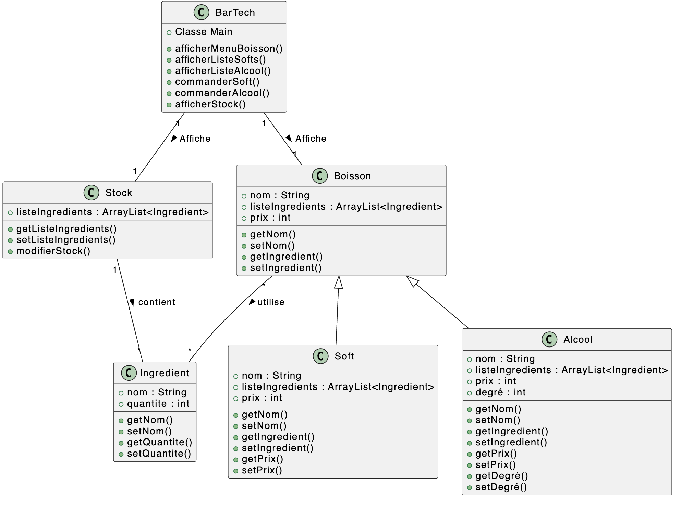
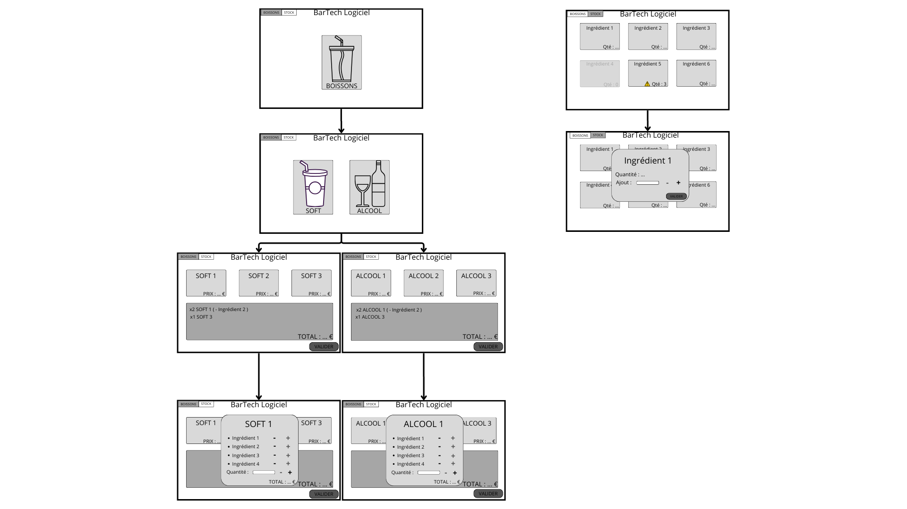

# BarTech

## Introduction

Dans le cadre du module « Programmation orientée objet », nous sommes amenés à réaliser un projet au sujet libre dans le langage de programmation JAVA. 
Ce document permet donc d’établir les fonctionnalités globales du projet, et de présenter les différentes perspectives que nous avons pour ce dernier.

## Présentation du projet et des fonctionnalités

Le but du projet est de réaliser une interface permettant la gestion de stock d’un bar. Dans un premier onglet l’utilisateur pourra renseigner les entrées de stock manuellement et avoir une vision en temps réel de son stock d’ingrédients. 

Dans un second onglet, il aura accès à toutes les boissons qu’il sert afin de décrémenter le stock d’ingrédients utilisés pour la préparation d’une boisson choisie.

- [x] 	Choisir une boisson et décrémenter automatiquement les ingrédients en fonction des quantités (nombre de boissons commandées).
- [x] 	Ajout d’option de préparation des boissons (en enlevant un ingrédient par exemple).

- [ ] 	Générer une alerte lorsque le stock d’un ingrédient commence à être faible
- [ ] 	Indisponibilité de certaines boissons si le stock d’un ingrédient est vide (grisée dans l’IHM).
- [ ] 	[OPTIONNEL] Étapes 2, 3 et 5 pour des snacks (sous onglet de l’onglet « Boissons »)
- [ ] 	[OPTIONNEL] Ajout de comptes utilisateurs pour les barmans avec des droits pour gérer le stock.
- [ ] 	[OPTIONNEL] Statistiques de vente des barmans (nombre de boissons vendues).

## Diagramme de classe

La figure 1 présente le diagramme de classe de notre projet (UML).

# Maquette IHM

La figure 2 présente les maquettes des différentes interfaces IHM prévues pour notre projet.

#### Indiquer les ressources (site web, video, IA générative, etc) q

# Commandes Git

Pour importer la bonne version à jour du main (quand tu commences a bosser)

	- git checkout main
	-  git pull

Pour modifier (JAMAIS DANS LE MAIN)

Il faut être dans le dossier de base de BarTech

 	- git add *
 	- git commit -a -m "Message de commit"
 	- git push

Pour les branches :

 - git branch *nom de la branche* 	(crée une nouvelle branche)
 - git checkout *branche*		(changer de branche)